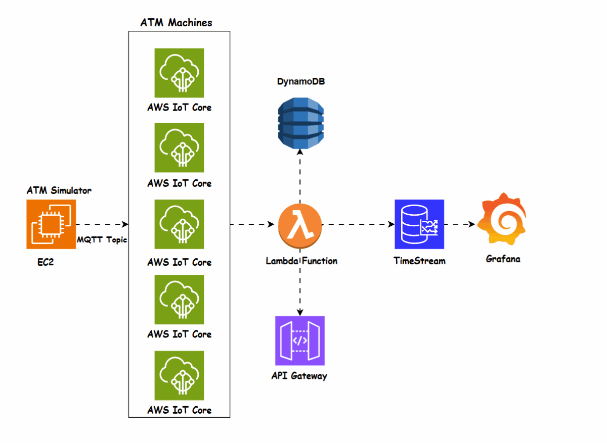

# ATM Health Automation with AWS

## Project Overview
This project is designed to monitor the health and cash flow of ATMs in real-time to assist bank administrators in ensuring operational efficiency. Additionally, there is an API that can be used to provide customers with real-time updates about ATM statuses through a mobile app or web platform, showcasing a proof-of-concept (POC) for the feasibility of this project.

### Objectives:
- Monitor the health of ATMs (e.g., status, cash levels, location).
- Provide real-time ATM status for administrators and customers.
- Send alerts for critical situations (e.g., low cash, ATM down).
- Enable data visualization through Grafana dashboards.

---
## Architecture Diagram

## Flow of the System

### Simulated ATM Data:
- A Python script was created to simulate ATM data (e.g., `atm_id`, `status`, `cash_level`, `transactions`, `timestamp`).
- The script publishes this data to an MQTT topic (`atm/health`) in AWS IoT Core.
- The script was run from an EC2 instance, allowing the simulation to operate in a scalable and reliable environment.

### AWS IoT Core Setup:
- AWS IoT Core was configured to receive data from the simulated ATMs.
- An IoT Rule was created to route incoming data from the MQTT topic to a Lambda function for further processing.

### AWS Lambda:
- The Lambda function handled most of the data processing and transformation.
- It managed API integrations, data streaming to DynamoDB and Timestream, and processed alerts.
- The Lambda function also ensured a high level of security for the API, protecting it from unauthorized access.

### Amazon DynamoDB:
- Used to store ATM status data, including `atm_id`, `status`, `cash_level`, `timestamp`, and more.
- Provided a reliable storage solution for real-time updates.

### Amazon Timestream:
- Designed for time-series data storage and querying.
- Facilitated historical data analysis and advanced querying for metrics like low-cash ATMs.

### Grafana Dashboards:
- Used to create dashboards for data visualization:
  - ATM status distribution (e.g., Working, Low-Cash, Down).
  - Critical ATM details.
  - Transaction statistics.
- Allowed administrators to monitor ATM statuses and prioritize actions based on real-time insights.

---

## AWS Services Used

### Amazon EC2:
- Used to run the Python ATM simulator, providing a scalable and reliable environment for simulating ATM data.
- Enabled the simulator to publish data to AWS IoT Core efficiently.

### AWS IoT Core:
- Facilitated real-time communication between the ATM simulator and AWS services.
- Managed MQTT topics and routed incoming data to AWS Lambda using IoT Rules.

### Amazon DynamoDB:
- Used to store ATM status data, including `atm_id`, `status`, `cash_level`, `timestamp`, and more.
- **Challenges**: Querying aggregated data in DynamoDB required additional planning and the use of PartiQL. 

### Amazon Timestream:
- Designed for time-series data storage and querying.
- Used to handle historical and real-time data for ATM operations.
- **Challenges**: Correctly structuring data with dimensions and measures; debugging timestamp-related issues (e.g., `RejectedRecordsException`).

### AWS Lambda:
- Used to process ATM data and handle various tasks:
  - Ingest data from a Python simulator.
  - Process and transform DynamoDB data for Timestream.
  - Provide APIs for Grafana integration.
- **Challenges**: Handling JSON serialization errors; structuring modular Lambda functions for reusability and maintainability.

### Amazon SNS (Simple Notification Service):
- Used to send alerts to administrators for critical ATM situations, such as:
  - Low-Cash
  - ATM Down
- **Challenges**: Configuring topic permissions; ensuring alerts were triggered only for valid conditions.

### Amazon API Gateway:
- Provides a RESTful API interface for retrieving ATM data.
- Used by Grafana JSON API plugin for dashboard integration.
- **Challenges**: Setting up and debugging integration routes; ensuring the Lambda integration passed accurate data.

### Grafana:
- Used to create dashboards for data visualization:
  - ATM status distribution (e.g., Working, Low-Cash, Down).
  - Critical ATM details.
  - Transaction statistics.
- **Challenges**: Setting up the Timestream data source; configuring row and cell-based conditional formatting.

---

## Lessons Learned and Challenges Overcome

### AWS Timestream:
- Transitioned to Timestream from DynamoDB for improved analytics capabilities.
- Learned how to structure dimensions and measures correctly to enable powerful querying.
- Addressed timestamp-related issues such as `RejectedRecordsException` by ensuring proper time formatting and retention period alignment.

### AWS Lambda:
- Gained experience with Lambda for data processing, API integration, and secure access.
- Solved challenges related to JSON serialization and modularized the codebase for reusability.

### Grafana Dashboards:
- Initially faced limitations with DynamoDB as a data source but successfully transitioned to Timestream for seamless integration and real-time data visualization.
- Learned to apply conditional formatting and customize dashboards for critical ATM statuses.

---

## Impact and Skills Demonstrated
This project deepened my expertise in AWS services such as AWS IoT Core, Lambda, Timestream, DynamoDB, API Gateway, and SNS. It also taught me advanced visualization techniques with Grafana. By working on this project, I developed strong skills in designing and deploying scalable, secure, and efficient cloud solutions tailored to business needs. Additionally, creating Python scripts for ATM simulation and integrating them with AWS services enhanced my practical understanding of IoT and real-time monitoring systems.

---

## Conclusion
This project demonstrates the integration of multiple AWS services to create a scalable, real-time monitoring system. It highlights the importance of modular design, careful testing, and proper tool selection (e.g., Timestream over DynamoDB for analytics). The lessons learned provide a strong foundation for future IoT and analytics projects.

---

*Made by Seif Yakout*
